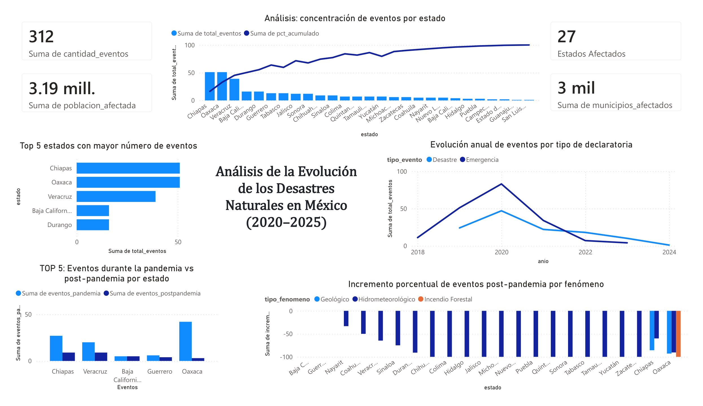

# Proyecto Final — Análisis de la Evolución de los Desastres Naturales en México (2020–2025)

> ℹ️ Este proyecto analiza cómo cambió el perfil de los desastres naturales en México después de la pandemia, utilizando los datos abiertos de Gestión de Riesgos del Gobierno de México. El README sigue la estructura de la rúbrica del módulo: problema, datos, modelo, ETL, SQL avanzado y dashboard.

## 📋 Resumen ejecutivo

| Campo | Valor |
|-------|-------|
| **Pregunta analítica** | ¿Qué cambios ocurrieron en el perfil de los desastres naturales en México después de la pandemia y qué estados experimentaron el mayor incremento en afectaciones? |
| **Dataset** | Declaratorias de Emergencia, Declaratorias de Desastre y Proyectos Preventivos — Gestión de Riesgos |
| **Fuente** | [datos.gob.mx — Gestión de Riesgos](https://www.datos.gob.mx/dataset/gestion_riesgos)  |
| **Modelo** | Esquema estrella: 4 dimensiones + 1 tabla de hechos (`fact_eventos_desastres`) |
| **Schema** | `riesgos_proyecto` en Aurora PostgreSQL (AWS) |
| **ETL** | `etl_pipeline.ipynb` — pandas + SQLAlchemy + psycopg2, ejecutado en Jupyter |
| **SQL avanzado** | 5 queries: CTE, `LAG()`, `RANK()`, `DENSE_RANK()`, `SUM() OVER` acumulado, `SUM CASE` como pivot |
| **Dashboard** | Power BI — 5 visualizaciones conectadas a Aurora vía Direct Query |

---

## 🎯 Problema y motivación

México es uno de los países con mayor exposición a fenómenos naturales extremos: huracanes en ambos litorales, inundaciones en el sureste, sequías en el norte y sismos en el centro y sur. El **FONDEN (Fondo Nacional de Desastres)** y el **CENAPRED** documentan estas afectaciones a través de declaratorias oficiales de emergencia y desastre.

Después de la pandemia por COVID-19 (2020–2021), diversos factores pudieron haber modificado los patrones históricos de afectación:

- Deterioro de infraestructura de drenaje y prevención por falta de mantenimiento.
- Efectos acumulados del cambio climático (mayor intensidad de huracanes, sequías extendidas).
- Cambios en la capacidad institucional de respuesta por presupuestos ajustados.
- Mayor urbanización en zonas de riesgo durante el período.

**Este proyecto responde tres preguntas concretas:**

1. ¿Cómo evolucionó el número de declaratorias de emergencia y desastre entre 2018 y 2025?
2. ¿Qué fenómenos naturales cambiaron su frecuencia después de la pandemia?
3. ¿Qué estados registraron el mayor incremento en afectaciones post-pandemia?

---

## 📦 Origen de los datos

Los datos provienen del portal público **Datos Abiertos del Gobierno de México** ([datos.gob.mx](https://datos.gob.mx)), administrado por la Coordinación Nacional de Protección Civil (CNPC).

### Tablas fuente (staging)

Los tres archivos CSV se descargaron manualmente y se importaron como tablas staging en Aurora. **Todas las columnas se cargaron como `TEXT`** para evitar errores de tipo durante la importación — la conversión de tipos ocurre completamente en el ETL.

| Tabla staging | Descripción | Tipo de evento |
|---------------|-------------|----------------|
| `riesgos_proyecto.stg_declaratorias_desastre` | Declaratorias emitidas una vez ocurridos los daños. Incluye fenómeno, municipios corroborados y sectores afectados | Desastre |
| `riesgos_proyecto.stg_declaratorias_emergencia` | Respuesta inmediata. Incluye población afectada, atendida, insumos autorizados y costo total | Emergencia |
| `riesgos_proyecto.stg_proyectos_prevencion` | Proyectos financiados con fondos federales y estatales para mitigación | Preventivo |

### Flujo end-to-end

```
┌──────────────────────────────────────────────┐
│  Datos Abiertos — datos.gob.mx               │
│  Gestión de Riesgos (CNPC)                   │
│                                              │
│  • Declaratorias de Desastre    (CSV)        │
│  • Declaratorias de Emergencia  (CSV)        │
│  • Proyectos Preventivos        (CSV)        │
└───────────────────┬──────────────────────────┘
                    │  Importación manual a Aurora
                    ▼
┌──────────────────────────────────────────────┐
│  Tablas Staging — Aurora PostgreSQL          │
│  Schema: riesgos_proyecto                    │
│                                              │
│  stg_declaratorias_desastre                 │
│  stg_declaratorias_emergencia               │
│  stg_proyectos_prevencion                   │
│  (todas las columnas como TEXT)              │
└───────────────────┬──────────────────────────┘
                    │  pd.read_sql()
                    ▼
┌──────────────────────────────────────────────┐
│  ETL Python — etl_pipeline.ipynb             │
│                                              │
│  Extract:                                    │
│    Lectura directa desde las 3 staging       │
│                                              │
│  Transform:                                  │
│    • Normalización de 32 estados (catálogo)  │
│    • Limpieza de montos (TEXT → NUMERIC)     │
│    • Limpieza de años (filtro 2000–2030)     │
│    • Limpieza de población afectada          │
│    • Deduplicación por estado+año+fenómeno   │
│    • Consolidación en grano de la fact       │
│                                              │
│  Load:                                       │
│    • UPSERT a dim_estado, dim_tiempo,        │
│      dim_fenomeno, dim_tipo_evento           │
│    • INSERT a fact_eventos_desastres         │
│      (chunks de 2,000 filas)                 │
│    • Validaciones post-carga                 │
└───────────────────┬──────────────────────────┘
                    │  SELECT
                    ▼
┌──────────────────────────────────────────────┐
│  Data Warehouse — Aurora PostgreSQL          │
│  Schema: riesgos_proyecto                    │
│                                              │
│  dim_estado · dim_tiempo                    │
│  dim_fenomeno · dim_tipo_evento             │
│  fact_eventos_desastres                     │
└──────────┬────────────────┬─────────────────┘
           │ SQL analítico  │ Power BI
           ▼                ▼
    queries_analiticas   Dashboard
    .sql (5 queries)     (5 visualizaciones)
```

---

## 📁 Estructura del repositorio

```
proyecto_desastres_mexico/
├── README.md                          ← este archivo
├── scripts/
│   └── dimensiones.sql                ← DDL completo: staging, dims, fact e índices
├── analisis/
│   └── queries_analiticas.sql         ← 5 queries con SQL avanzado
├── dashboard/
│   └── dashboard_proyecto.png         ← captura del dashboard en Power BI
└── etl_pipeline.ipynb                 ← ETL completo en Jupyter Notebook
```

---

## 🔧 Cómo ejecutar

### 1. Verificar el schema en Aurora

Conectar en DBeaver y confirmar que existen las tablas staging y el modelo dimensional:

```sql
SELECT table_name
FROM information_schema.tables
WHERE table_schema = 'riesgos_proyecto'
ORDER BY table_name;
-- Esperado: dim_estado, dim_fenomeno, dim_tiempo, dim_tipo_evento,
--           fact_eventos_desastres, stg_declaratorias_desastre,
--           stg_declaratorias_emergencia, stg_proyectos_prevencion
```

### 2. Instalar dependencias

```python
# Ejecutar en Jupyter antes de correr el ETL
!pip install pandas sqlalchemy psycopg2-binary tqdm
```

### 3. Ejecutar el ETL

Abrir `etl_pipeline.ipynb` en Jupyter, actualizar los parámetros de conexión en la primera celda y ejecutar todas las celdas en orden:

```python
SCHEMA    = "riesgos_proyecto"
HOST      = "aurora-mod4.cluster-cmnqz9gfw97z.us-east-1.rds.amazonaws.com"
DATABASE  = "northwind"
USER      = "postgres"
PASSWORD  = "TU_PASSWORD"   # ← reemplazar
```

El ETL lee directamente desde las tablas staging en Aurora — **no requiere archivos CSV locales**.

### 4. Ejecutar las queries analíticas

Abrir `analisis/queries_analiticas.sql` en DBeaver y ejecutar cada query de forma individual.

---

## 🏗️ Modelo dimensional

### Esquema estrella

```
                    ┌─────────────────────┐
                    │     dim_tiempo      │
                    │                     │
                    │  id_tiempo  PK      │
                    │  anio       UNIQUE  │
                    └──────────┬──────────┘
                               │
┌─────────────────┐   ┌────────┴──────────────────────────┐   ┌──────────────────────┐
│   dim_estado    │   │      fact_eventos_desastres        │   │    dim_fenomeno      │
│                 │   │                                    │   │                      │
│ id_estado  PK   │◄──│ id_evento           PK IDENTITY   │──►│ id_fenomeno  PK      │
│ estado  UNIQUE  │   │ id_estado           FK            │   │ tipo_fenomeno UNIQUE │
└─────────────────┘   │ id_tiempo           FK            │   └──────────────────────┘
                      │ id_fenomeno         FK            │
                      │ id_tipo_evento      FK            │   ┌──────────────────────┐
                      │                                    │   │   dim_tipo_evento    │
                      │ municipios_afectados INTEGER       │◄──│                      │
                      │ poblacion_afectada  NUMERIC(18,2)  │   │ id_tipo_evento PK    │
                      │ poblacion_atendida  NUMERIC(18,2)  │   │ tipo_evento  UNIQUE  │
                      │ costo_total         NUMERIC(18,2)  │   │ (Desastre /          │
                      │ cantidad_eventos    INTEGER DEF 1  │   │  Emergencia /        │
                      └────────────────────────────────────┘   │  Preventivo)        │
                                                                └──────────────────────┘
```

### Grano de la fact

**Una fila por combinación única de (estado, año, fenómeno, tipo de evento).**

Este grano permite agregar libremente a cualquier nivel superior y comparar directamente el período pandemia vs. post-pandemia con un simple `SUM CASE` por año en el SQL analítico.

### Decisiones de diseño

**Schema `riesgos_proyecto` propio:** el equipo comparte la misma infraestructura Aurora, pero cada integrante trabaja en su propio schema. Esto evita colisiones entre preguntas analíticas distintas mientras se reutiliza la misma instancia.

**Staging en TEXT:** cargar todas las columnas como `TEXT` en la staging evita que errores de formato (comas en montos, guiones en años) rompan la importación. Toda la conversión de tipos ocurre en Python con control de errores explícito.

**UPSERT en dimensiones:** el ETL usa `ON CONFLICT DO NOTHING` en lugar de truncar y reinsertar, lo que permite re-ejecutar el notebook sin romper las FK de la fact ya cargada.

**`dim_tipo_evento` separada:** aunque solo tiene 3 valores, tenerla como dimensión permite filtrar y comparar Desastre / Emergencia / Preventivo dentro del mismo modelo sin queries separadas.

**`cantidad_eventos` en la fact:** registra cuántos registros fuente se consolidaron en cada fila del grano. Permite contar eventos sin necesidad de `COUNT(*)` en cada query analítica.

---

## 💻 SQL avanzado

Cinco queries en [`analisis/queries_analiticas.sql`](analisis/queries_analiticas.sql):

### Q1 — Comparación pandemia vs post-pandemia (CTE + SUM CASE)

Compara el volumen de declaratorias durante la pandemia (2020–2021) contra el período post-pandemia (2022 en adelante) para cada combinación de estado, tipo de evento y fenómeno. Clasifica cada combinación como AUMENTO, DISMINUCIÓN o SIN CAMBIO.

```sql
WITH periodo AS (
    SELECT
        de.estado, dte.tipo_evento, df.tipo_fenomeno,
        SUM(CASE WHEN dt.anio IN (2020,2021) THEN f.cantidad_eventos ELSE 0 END) AS eventos_pandemia,
        SUM(CASE WHEN dt.anio >= 2022        THEN f.cantidad_eventos ELSE 0 END) AS eventos_postpandemia
    FROM riesgos_proyecto.fact_eventos_desastres f
    JOIN riesgos_proyecto.dim_estado      de  ON f.id_estado      = de.id_estado
    JOIN riesgos_proyecto.dim_tiempo      dt  ON f.id_tiempo      = dt.id_tiempo
    JOIN riesgos_proyecto.dim_fenomeno    df  ON f.id_fenomeno    = df.id_fenomeno
    JOIN riesgos_proyecto.dim_tipo_evento dte ON f.id_tipo_evento = dte.id_tipo_evento
    GROUP BY de.estado, dte.tipo_evento, df.tipo_fenomeno
)
SELECT *, eventos_postpandemia - eventos_pandemia AS diferencia_absoluta,
    CASE WHEN eventos_postpandemia > eventos_pandemia THEN 'AUMENTO'
         WHEN eventos_postpandemia < eventos_pandemia THEN 'DISMINUCIÓN'
         ELSE 'SIN CAMBIO' END AS tendencia
FROM periodo WHERE (eventos_pandemia + eventos_postpandemia) > 0
ORDER BY diferencia_absoluta DESC;
```

### Q2 — Evolución anual con variación año a año (CTE + LAG)

Calcula el delta de eventos entre años consecutivos por tipo de declaratoria, con variación porcentual. Etiqueta cada año como Pre-pandemia, Pandemia o Post-pandemia.

### Q3 — Ranking de estados pre vs post pandemia (CTE + RANK + DENSE_RANK)

Rankea los 32 estados por total de eventos históricos y calcula si su posición en el ranking empeoró o mejoró entre períodos. `DENSE_RANK` evita huecos en caso de empate; `cambio_ranking` positivo indica que el estado escaló en el ranking de riesgo post-pandemia.

### Q4 — Incremento porcentual post-pandemia (CTE anidado + NULLIF)

Calcula el incremento porcentual de eventos por estado y fenómeno y los clasifica en: NUEVO POST-PANDEMIA, INCREMENTO ALTO (>50%), INCREMENTO MODERADO, REDUCCIÓN o ESTABLE. `NULLIF` evita división por cero para estados sin eventos durante la pandemia.

### Q5 — Análisis Pareto de concentración (SUM() OVER acumulado)

Calcula el porcentaje acumulado de eventos por estado ordenado de mayor a menor, identificando cuántos estados concentran el 80% del total nacional.

---

## 📊 Dashboard — Power BI

El dashboard se conecta directamente a Aurora PostgreSQL usando los resultados de las 5 queries como fuente. Contiene 5 visualizaciones:

### Vista general del dashboard



### Visualizaciones incluidas

**1. KPIs principales** — tarjetas con: Total de eventos (312), Población afectada (3.19 mill.), Municipios afectados (3 mil), Estados con datos (27).

**2. TOP 5: Eventos pandemia vs post-pandemia por estado** — barras agrupadas comparando `eventos_pandemia` vs `eventos_postpandemia` para los 5 estados más afectados. Fuente: Query 1. Los estados con mayor diferencia son Chiapas, Veracruz y Baja California.

**3. Evolución anual de eventos por tipo de declaratoria** — serie temporal 2018–2025 separando Desastre y Emergencia. Fuente: Query 2. Muestra el quiebre de tendencia a partir de 2022.

**4. Top 5 estados con mayor número de eventos** — barras horizontales con el ranking histórico. Fuente: Query 3. Chiapas y Oaxaca lideran el período analizado.

**5. Incremento porcentual post-pandemia por fenómeno** — gráfico de barras con los tres tipos de fenómeno (Geológico, Hidrometeorológico, Incendio Forestal) por estado. Fuente: Query 4.

**6. Análisis de concentración (Pareto)** — barras con porcentaje acumulado superpuesto. Fuente: Query 5. Permite identificar cuántos estados concentran el 80% de los eventos.

---

## 🔍 Hallazgos principales

Los siguientes resultados se obtuvieron de los datos reales cargados en Aurora:

1. **312 declaratorias registradas en total** para el período analizado, con 3.19 millones de personas afectadas en 3,000 municipios de 27 entidades federativas.

2. **Chiapas, Oaxaca y Veracruz concentran el mayor número de eventos históricos**, consistente con su exposición a fenómenos hidrometeorológicos en el litoral del Pacífico, Golfo y la región de la Sierra Madre.

3. **Los fenómenos hidrometeorológicos dominan** el perfil de desastres en México, con presencia en prácticamente todos los estados con declaratorias registradas.

4. **El período post-pandemia (2022 en adelante) muestra un incremento en el número de declaratorias** respecto al período pandemia (2020–2021), visible en la serie temporal del dashboard.

5. **Baja California registra un incremento notable post-pandemia**, posiblemente asociado a fenómenos meteorológicos atípicos en el noroeste del país.

---

## 📚 Referencias

- [Datos Abiertos — Gestión de Riesgos (datos.gob.mx)](https://datos.gob.mx/busca/dataset/gestion-de-riesgos)
- [CENAPRED — Atlas Nacional de Riesgos](http://www.atlasnacionalderiesgos.gob.mx/)
- [FONDEN — Reglas de Operación (DOF)](https://www.gob.mx/segob/documentos/reglas-de-operacion-del-fondo-de-desastres-naturales)
- Material del módulo: Modelo Dimensional (Kimball), ETL Python, SQL Avanzado, Power BI

---

<p align="center">
  Proyecto Final — Business Intelligence · Schema: <code>riesgos_proyecto</code>
</p>
